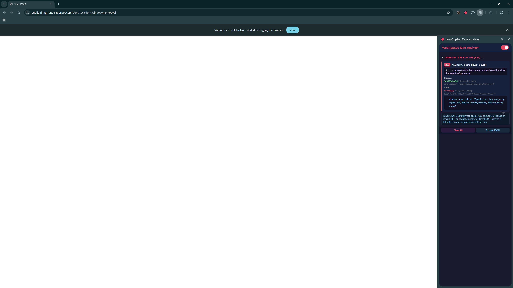

# WebAppSec Taint Analyzer

A Chrome extension (MV3) that performs real-time, AST-based taint analysis on web applications. It intercepts JavaScript as pages load, parses it with Babel, builds control flow graphs, and traces attacker-controlled data from sources to dangerous sinks — detecting XSS, prototype pollution, open redirects, and other client-side vulnerabilities.



## How It Works

1. **Script interception** — The background service worker attaches Chrome DevTools Protocol (CDP) via `chrome.debugger` to collect every script loaded by a page, including inline scripts, dynamically injected scripts, and ES modules.

2. **AST parsing** — Scripts are sent to a web worker (via an offscreen document) where Babel parses them into ASTs. This works on both formatted and minified code since the parser operates on syntax structure, not formatting.

3. **Control flow graph** — A CFG is built from each AST with a worklist-based fixpoint algorithm, handling branches, loops, try/catch, and short-circuit evaluation.

4. **Taint analysis** — The engine tracks data flow from sources (e.g. `location.hash`, `document.cookie`, `postMessage` data) through assignments, function calls, and object properties to sinks (e.g. `innerHTML`, `eval`, `document.write`). It supports:
   - Interprocedural analysis (function calls, closures, factories)
   - Cross-file analysis (shared globals, ES module imports/exports)
   - Object property and `this.*` binding propagation
   - Array method callbacks (`forEach`, `map`, `reduce`, etc.)
   - Sanitizer recognition (DOMPurify, encodeURIComponent, etc.)

5. **Reporting** — Findings appear as badge counts and browser notifications, with full details in the side panel including source/sink locations, taint flow paths, and remediation advice. Findings persist in IndexedDB across browser restarts.

## Project Structure

```
src/
  manifest.json          # Chrome MV3 manifest
  background.js          # Service worker — CDP attach, script collection, notifications
  popup/                 # Side panel UI (findings viewer, toggle, export)
    popup.html
    popup.js
    popup.css
  offscreen/             # Offscreen document (hosts the web worker, persists findings to IndexedDB)
    offscreen.html
    offscreen.js
  worker/                # Taint analysis engine (runs in web worker)
    index.js             # Worker entry — message handler, orchestration
    taint.js             # Core taint engine — CFG worklist, expression evaluation
    cfg.js               # Control flow graph builder
    sources-sinks.js     # Source/sink/sanitizer definitions
    module-graph.js      # Cross-file analysis, import/export resolution
    scope.js             # Scope analysis for variable resolution
    cache.js             # Finding dedup key utilities
  icons/
test/
  test.mjs               # Test suite (599 tests)
  harness.mjs            # Test harness wrapping the analysis engine
  libs/                  # Minified production libraries for false-positive baseline
```

## Vulnerability Detection

| Category | Examples |
|---|---|
| **XSS** | `innerHTML`, `outerHTML`, `document.write`, `eval`, `Function()`, `setTimeout(string)` |
| **Open Redirect** | `location.href = tainted`, `window.open(tainted)` |
| **Prototype Pollution** | `obj[tainted][tainted] = value` patterns |
| **postMessage** | Missing origin checks on message event handlers |
| **Cookie Manipulation** | `document.cookie = tainted` |

## Taint Sources

- URL components: `location.hash`, `location.search`, `location.href`, `location.pathname`
- Document properties: `document.URL`, `document.referrer`, `document.cookie`
- Storage: `localStorage.getItem()`, `sessionStorage.getItem()`
- URL APIs: `new URL()`, `URLSearchParams.get()`
- Window: `window.name`
- Events: `postMessage` data, `hashchange` events

## Building

```bash
npm install
npm run build
```

The build (via esbuild) outputs to `dist/`. Load `dist/` as an unpacked extension in Chrome.

## Testing

```bash
node test/test.mjs
```

The test suite includes:
- **Positive detections** — vulnerable code patterns that must be flagged
- **Negative/safe patterns** — sanitized or safe code that must not produce false positives
- **Function tracing** — interprocedural analysis: closures, factories, callbacks, aliases, class methods
- **Minified code** — taint detection on compressed/minified JavaScript
- **Baseline libraries** — jQuery, Lodash, React, Vue, Angular minified builds scanned for zero false positives

## Dependencies

- **@babel/parser** — JavaScript/TypeScript parsing to AST
- **@babel/traverse** — AST traversal utilities
- **esbuild** — Build/bundling (dev only)
